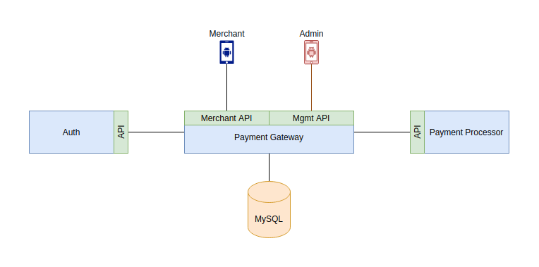

# Design Document

The `Payment Gateway exercise` is made up of 3 services.

The main service, `Payment Gateway service` is the service with most of the logic described by the exercise requirements.

The `Auth Service` is there just to simulate an external system validating authentications performed by the `Payment Gateway service`.

The `Payment Processor service` simulates a 3rd party accepting requests from the `Payment Gateway service`. This service is pretty dumb, it will allow everything except requests for certain credit card numbers. It won't do any validation checking on anything.

## Design decisions

I decided to create an authentication service to simulate the most common scenarios in production, where we have the services performing business operations and consulting an external authentication system for validating access to resources.

Authentication can be done in many different ways, some of the more common ones are:

- Oauth + JWT - a service gets a JWT token and can perform authentication and authorization validation without contacting any external service. This is possible because the tokens contain a bunch of useful information like claims and are signed.
- Permanent tokens - a pair of credentials is associated with a token that is permanent until it gets revoked and replaced by a new one. In case of a leak, only the token needs to be replaced. The user credentials are never exposed.
- Session tokens - a user requests a token that is only valid for the duration of a session. These tokens will typical expire after a certain time or will become unusable once the user logs out.
- Basic auth - a user sends their credentials on every request.
- and many many more...

For this exercise, I've decided to go with basic auth, because it's the easiest of all to implement, but at the same time the most insecure, in the sense that very sensitive data (user credentials) are sent on every request.

The way the authentication mechanism works for this system is, the `payment gateway service` gets a request. If the request contains an `Authorization header` with BasicAuth encoded in it, it will contact the `auth service` to validate whether the credentials exist in the "database", if they do, the `auth service` will send a positive response and the `payment gateway service` will continue to process the request.

Notice I've put "database" in quotes. Because the `auth service` is not the main service in this exercise, and because I only really created it to simulate interactions with a 3rd party system, I've decided to implement the `auth service` in a way that on start up, it reads credentials from a yaml file and loads them into memory. All validation requests made to this service will then be performed based on the comparison of the credentials supplied against the set of credentials in memory. We cannot add or remove credentials while the service is running. This is obviously not a service created for production use. It's been merely created to support the main system, the `payment gateway service`.

A note goes to the fact that, if I had used a database for the `auth service` the next step would be to add a caching system to allow for faster response times. If I were to improve this system further, I'd drop completely the BasicAuth implementation and go with something better like Oauth + JWT.

The `auth service` only provides authentication functionality, no authorisation is performed.

The `payment processor service` as mentioned above is only there to simulate interactions with a 3rd party system. It's a pretty dumb service that will not perform any checks on anything. Apart from providing a system to be contacted by the `payment gateway service` it offers two other functions. First, this is the service that will reject cards at different stages, so it provides us with a simple and segregated mechanism to test edge cases. One of the exercise's ask was to have logic to test for certain edge cases like for example failure when trying to authorise a payment. The second function of this service is to generate the Unique IDs upon a payment authorisation. I made the assumption that these are tracked by the payment approvers (i.e., banks) to know which transactions can be carried out and up to what limit, therefore I made this service generate the UID and return it back in a response.

The `payment processor service` does not rely on a database either. The same line of thought was used here. These services are only "support services", they are not the main components and they would most likely be replaced by different systems in production, either by other more complex systems deployed by the same company or by 3rd party services providers as it's the case for the `payment processor service`.

With this in mind, the `payment processor service` on start up, will read from a yaml files which credit cards and for what reason should they fail. For example, in the yaml file we can define that credit card number `4000 0000 0000 0119` will fail when a request comes in to authorise a payment.

Because this system also generates unique IDs upon approval of payment requests, we need to track this state to be able to fail calls on later requests which only provide the unique ID. For this service, this state is being kept in memory, which means if we restart the service we will lose the state. Again, I did not rely on a database here because this is a service I created to allow for full interactions between the `payment gateway service` and this service.

The unique IDs are generated based on `UUID v4`.

One of the exercise requirements was to fail on certain conditions for certain credit cards to allow for testing of edge cases.
Instead of hardcoding this logic on the `payment gateway service` I decided to move this logic to the `payment processor service` as I believe this functionality sits better in there. We still have the ability to test for these use cases, we don't pollute the codebase of the `payment gateway service` with hardcoded values for testing purposes and we have the flexibility to change these credit card numbers and reasons to fail at will as they are read from a yaml file on startup.
I was only able to move this functionality to the `payment processor service` because for every request the `payment gateway service` receives, it in turn performs a request to the `payment processor service`, just like how it would happen in the real world.

Finally, for the main service, the `payment gateway service`, I rely on a database to keep track of all transactions and current state for each transaction.

I've decided to implement 2 APIs. One that is meant to be used by the merchants/clients, and another one that is meant to be used by the management team/back office team. The merchants API implements all the endpoint specified by the exercise requirements and are defined based on the OpenAPI specification.

The merchant API is secured by requiring the merchants to authenticate themselves using `Basic Auth`. The management API is not secured. Even though this doesn't make sense, I've decided to not secure the management API as it would require more logic on both the `payment gateway service` and the `auth service` since I'd have to support authorisation as well. We wouldn't want to have a merchant being allowed to have a pick into all the transactions our `payment gateway service` had performed so far.

In a production environment, if we had a service like this, the mgmt API wouldn't even be exposed to the internet. We would have different security zones for both APIs. Nonetheless, we would have to secure the mgmt API with some authentication/authorisation mechanism.

The `payment gateway service` keeps track of all transactions authorised and actions performed thereafter in a MySQL database. Each transaction is stored in the database with the respective state.

The problem described in the exercise resembles one of a state machines. We can very easily make sure certain steps are allowed or not depending on the current state, by storing the current state with the transaction ID.

For every request the `payment gateway service` gets, at some point, and assuming the request was authorised, the system will contact the `payment processor service` to carry on its tasks. It's at this poing that we might experience failure, like forcing an authorisation failure, or a capture failure, etc.

The mgmt API, allows us to get a list of authorised transactions and subsequent actions performed.

For this exercise's purpose, I'm storing the credit card details in the DB and even providing this information when using the mgmt API. I'm aware we don't need to store the credit card details for these particular exercise's use cases, and that providing the details via an API call is even worse from a security standpoint. This would most certainly violate PCI DSS compliance, but I did it anyway just for completeness.

## Development decisions

There is code in some of these services that could be reused and therefore, in a production grade codebase I'd most definitely be moving that code into their own libraries.

Some examples of that are: logging setup and their corresponding interfaces and implementation, configuration setup (in this case I'd rather use a library like Viper).

## API design decisions

For both APIs we start off with the API version in the path. There are a few ways of versioning APIs, I personally like this method more.

## Git workflow

Normally, I have 3 branches `master`, `test` and `develop` and I usually branch off `develop` to implement features. I then commit frequently to those feature branches and just before merging them I squash all commits in the feature branch into one, so the commit represents one unit of work.

For this project, I will not be doing that given the extra work and the fact that I'm not collaborating with anyone else. Instead, I'll be committing frequently to the master branch.

This applies to all repos belonging to this project.

## Extra points

I've completed all bonus points:

- [x] Implement Luhn check on credit card numbers
- [x] Merchant authentication
- [x] Application logging
- [x] Containerization

I've added a few extra things:

- [x] Created a simple auth service to simulate authentications with external systems
- [x] Created a payment processor simulator/mock
- [x] Implemented month/year expiry checks for credit cards
- [x] Currency support check. By default, app supports EUR, USD and GBP currencies. No capture or refunds are allowed with a currency which was not allowed by the authorise action.
- [x] All logs are in json for easy of parsing by a log aggregator like splunk or elasticsearch (logging in json is best practices)
- [x] All APIs are defined using an OpenAPI spec file. The merchant and management APIs for the `payment gateway service` are stored in this repo, and the API specs for the auth and payment processor services sit in their own repos
- [x] Added a management API to allow us to check transactions
- [x] Provided a docker-compose file and respective configuration to bring the whole system up, ready to be explored
- [x] All APIs have healthcheck endpoints as these are pretty much mandatory for any service in production that will sit behind a load balancer and even for monitoring purposes
- [x] Provided extensive documentation about the system design decisions, how to setup the environment and usage examples
